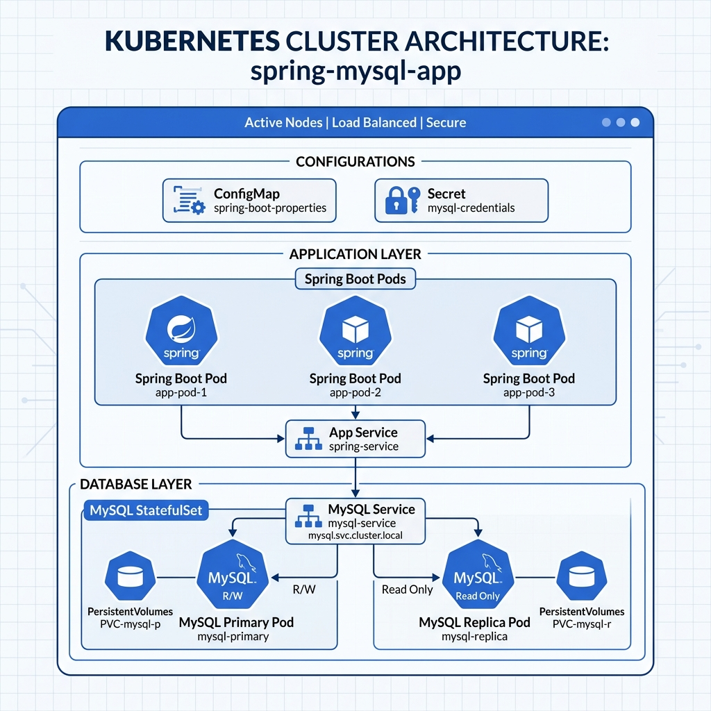
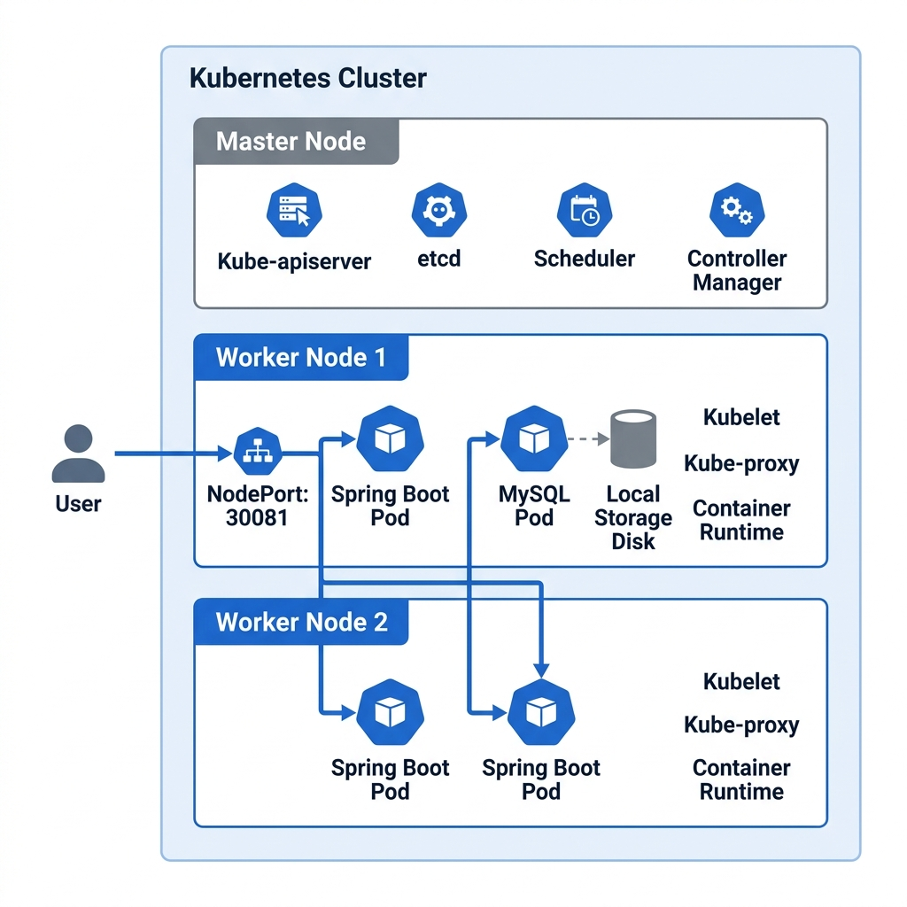

# Optimized Spring Boot Deployment on Kubernetes

이 프로젝트는 Spring Boot 3.5 애플리케이션을 Docker 호환 성과 배포 효율을 극대화하여 최적화하고, Kubernetes 멀티 노드 환경에서 인프라를 구축하는 실습 과정을 담고 있습니다.

## 🛠 Tech Stack
- **Framework**: Spring Boot 3.5.10 (Java 17)
- **Database**: MySQL 8.0 (StatefulSet)
- **Container**: Docker (Multi-stage Build & Layered JAR)
- **Orchestration**: Kubernetes (Ubuntu 24.04 LTS)

---

## System Architecture

### 1. Logical Architecture
애플리케이션과 데이터베이스의 논리적 계층 구조 및 설정 관리를 보여줍니다.


### 2. Physical Architecture
멀티 워커 노드(`worker01`, `worker02`) 환경에서 포드가 어떻게 분산 배치되고 서비스되는지를 나타냅니다.


---

## Docker Optimization Strategies

단순한 이미지 빌드가 아닌, 배포 효율을 위한 3가지 최적화 기법을 적용했습니다.

1.  **Multi-stage Build**: 빌드 시 JDK를 사용하고 실행 시 경량 JRE를 사용하여 이미지 크기를 최소화했습니다.
2.  **Layered JAR Extraction**: Spring Boot의 Layer 모드를 활용해 라이브러리(`dependencies`)와 소스 코드(`application`)를 분리했습니다. 변경이 잦은 소스 코드 레이어만 업로드되므로 푸시 속도가 비약적으로 향상됩니다.
3.  **Cross-Platform Build**: Mac(ARM64) 환경에서 빌드하되 Ubuntu(AMD64) 서버에서 즉시 동작할 수 있도록 `--platform linux/amd64` 빌드를 수행했습니다.

---

## Kubernetes Deployment Highlights

- **High Availability**: `podAntiAffinity` 설정을 통해 `emp-app` 포드가 서로 다른 물리 노드에 분산 배치되도록 구현했습니다.
- **Persistent Data**: `StatefulSet`과 워커 노드의 `Local Path`를 연결하여 DB 포드가 재기동되어도 데이터가 소실되지 않게 구축했습니다.
- **Config Management**: `ConfigMap`과 `Secret`을 사용하여 민감한 정보(DB ID/PW)와 환경 설정(Spring Profiles)을 애플리케이션 코드와 분리했습니다.
---

## 🚀 How to Run

```bash
# 1. MySQL 노드 레이블링
kubectl label nodes <node-name> app=mysql-node

# 2. MySQL 데이터 디렉토리 생성 및 권한 설정 (<node-name>은 MySQL이 배포될 노드)
mkdir -p /home/fisa/mysql
sudo chmod 777 /home/fisa/mysql

# 3. Namespace 및 설정 등록
kubectl apply -f namespace.yaml
kubectl apply -f configmap.yaml
kubectl apply -f secret.yaml

# 4. DB 및 앱 배포
kubectl apply -f mysql-stateful.yaml
kubectl apply -f deployment-app.yaml
```
---

## 🚨 Troubleshooting

실습 과정에서 발생한 주요 문제와 해결 방안입니다.

### 1️⃣ 포드가 계속 'Pending' 상태인 경우
- **증상**: `kubectl get pods` 확인 시 `mysql-0`이 `Pending` 상태에서 멈춤.
- **원인**: `nodeSelector`에 설정된 `app=mysql-node` 레이블이 워커 노드에 없어서 스케줄링이 불가능함.
- **해결**: `kubectl label nodes <노드이름> app=mysql-node` 명령어로 노드에 레이블을 부여하여 해결.

### 2️⃣ 데이터 접속 시 빈 배열 `[]` 반환 문제
- **증상**: MySQL에 직접 데이터를 넣었음에도 애플리케이션에서 조회가 안 됨.
- **원인**: **네임스페이스 불일치**. `default` 네임스페이스의 DB에 접속하여 데이터를 넣었으나, 앱은 `spring-mysql-app` 네임스페이스의 DB를 바라보고 있었음.
- **해결**: `kubectl exec -it mysql-0 -n spring-mysql-app...` 명령어로 정확한 네임스페이스의 DB에 데이터를 입력하여 해결.

### 3️⃣ 리눅스 환경의 대소문자 구분 이슈
- **증상**: 윈도우에서는 잘 되던 쿼리가 리눅스 K8s 환경에서 테이블을 못 찾음.
- **원인**: 리눅스용 MySQL은 테이블 이름의 대소문자를 구분함 (`dept` != `Dept`).
- **해결**: 엔티티 클래스에 `@Table(name="dept")`와 같이 소문자 이름을 명시하거나, MySQL 설정(`lower_case_table_names`)을 조정하여 해결.

---